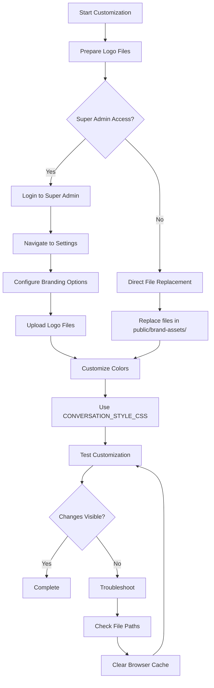

# Chatwoot Customization Workflow

## Testing Process

1. **Logo Customization Test**:
   - [ ] Replace logo files in `public/brand-assets/`
   - [ ] Verify logos appear in:
     - [ ] Login page
     - [ ] Dashboard header
     - [ ] Favicon
   - [ ] Check both light and dark modes

2. **Color Customization Test**:
   - [ ] Configure CONVERSATION_STYLE_CSS
   - [ ] Verify color changes in:
     - [ ] Conversation panel
     - [ ] UI elements
   - [ ] Test in both light and dark modes

3. **Performance Test**:
   - [ ] Check page load times
   - [ ] Verify no broken images
   - [ ] Confirm CSS is applied correctly

## Expected Results

After customization:
- Your brand logos should replace the default Chatwoot logos
- Your brand colors should be visible throughout the interface
- The customization should be visible to all users
- The system should perform normally with no errors

## Common Issues and Solutions

1. **Logos Not Showing**:
   - Check file paths and permissions
   - Verify SVG file format
   - Clear browser cache

2. **Colors Not Applying**:
   - Check CSS syntax
   - Verify configuration option names
   - Clear browser cache

3. **Performance Issues**:
   - Optimize SVG files
   - Minimize CSS code
   - Check server resources